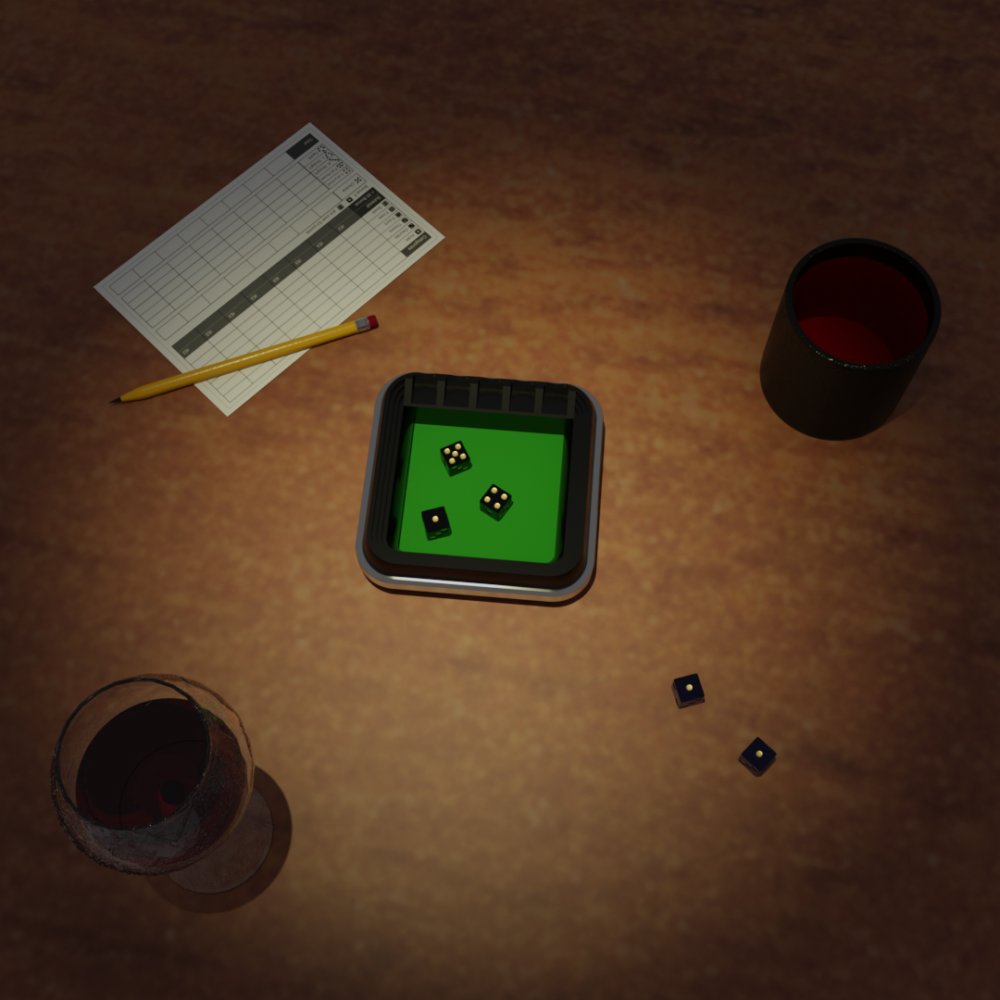
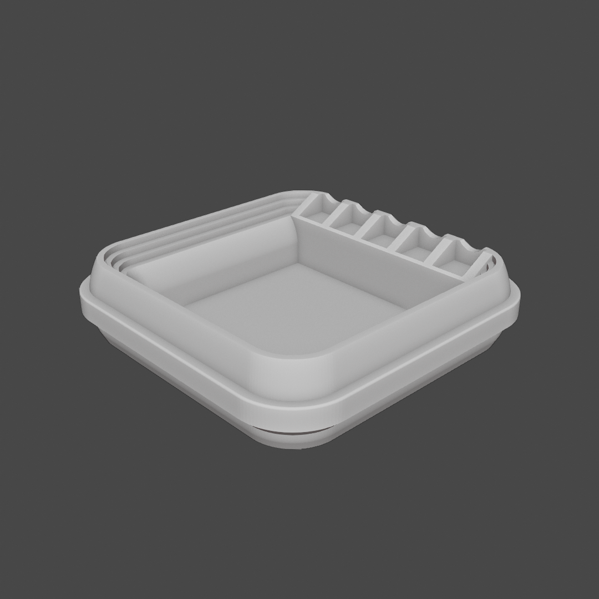

# Yacht Dice

- Download from Printables here: [`Download Link`](https://www.printables.com/model/572493-yacht-dice)
- Download from Thingiverse here: [`Download Link`](https://www.thingiverse.com/thing:6441417)

## Summary

3D print a dice keeper for your Yacht games!

* * *

# Summary

- **Change History**
    - **12/07/2025:** Improved model aesthetics!

- **What's Included:**
	- One dice keeper
	- Printable rules
	- Printable scorecards
	- Printable pattern used for the felt square on the inside of the dice keeper

# Print Settings

- Supports: None
- Infill: 5%
- Brim: true

# Bill of Materials

- Five 16 mm dice
- US Letter or A4 size paper
- Optional felt sheet at least 103 mm square
- Optional dice cup

# Additional Information

- **Notes**
    - Printable rules, scorecards, and patterns are provided in US Letter and A4 paper sizes.

* * *

# Previews

