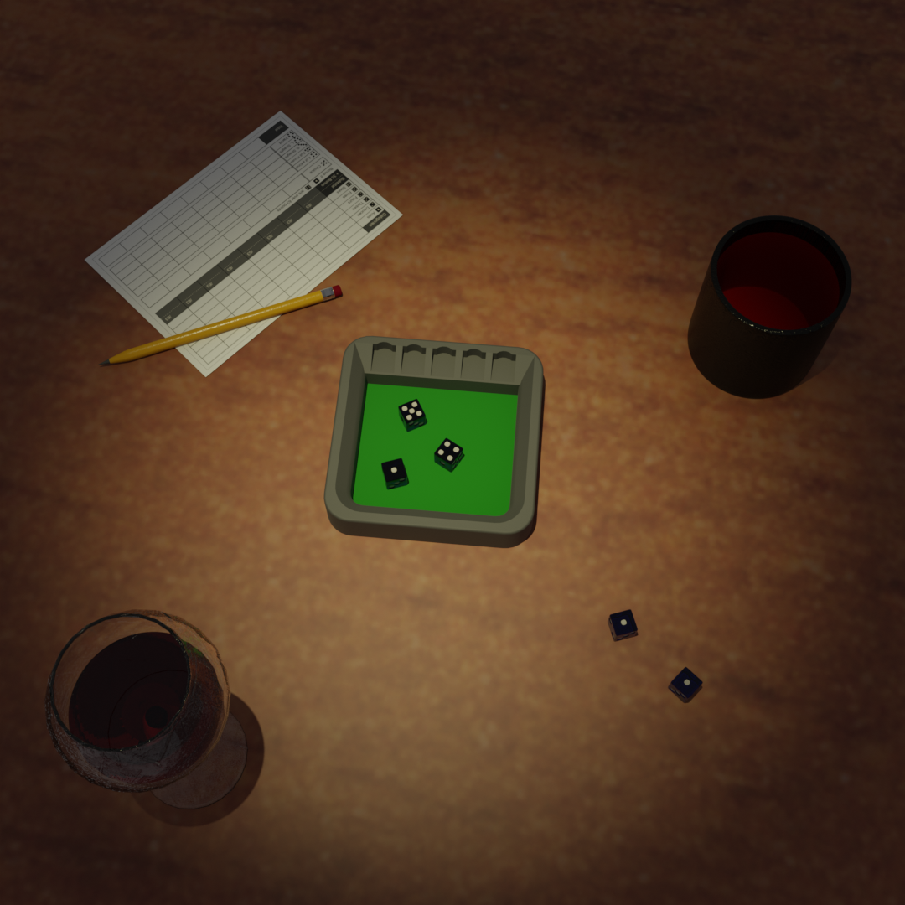

# Yacht Dice Keeper
### Yacht game rules and 3D printable accessory.

## Summary

3D print a dice keeper for your Yacht games!

## Bill of Materials

- Five 16 mm dice
- US Letter or A4 size paper
- Optional felt sheet at least 115 mm square
- Optional dice cup

## What's Included

- One dice keeper
- Printable rules
- Printable scorecards
- Printable pattern used for the felt square on the inside of the dice keeper

#### Notes:

- Printable rules, scorecards, and patterns are provided in US Letter and A4 paper sizes.

